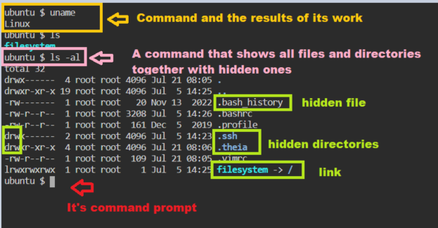

## Command line Syntaxes.

You can see in the picture like how commands would be in Linux.



### Commands

In terminal the first argument we give to execute is a command.

For example:

uname

uname is a command and that is the first word of a command line syntax.

### Options

Certain commands are going to have options, Options in Linux Command line will be a second and other argument over the command line. Usually those options will be seen in three formats..

```sh 
<command> -<single character> (Ex: -h , -v )
<command> --<single word> (Ex: --help , --version)
<command> -<single word> (Ex: -version, -help)
```

For example:

```
uname -a
```{{exec}}
```
uname --all
```{{exec}}

### Inputs

Certain commands require inputs, Inputs are given with options in some commands and without options for some commands.

For example list files in /etc directory:

```
ls /etc
```{{exec}}
```
ls -d /etc 
```{{exec}}

In above example ls is a command -d is an option and /etc is an input. Given the command with and without option changes the behavior of the command execution.

The first character
```
ls -al
```{{exec}}

'-’ – is a regular file
'd' – is a directory
'l' – is a symbolic link
'p' – is a named channel
'c' – is a byte-oriented device
'b' – is a block device


Ok, let`s next step.